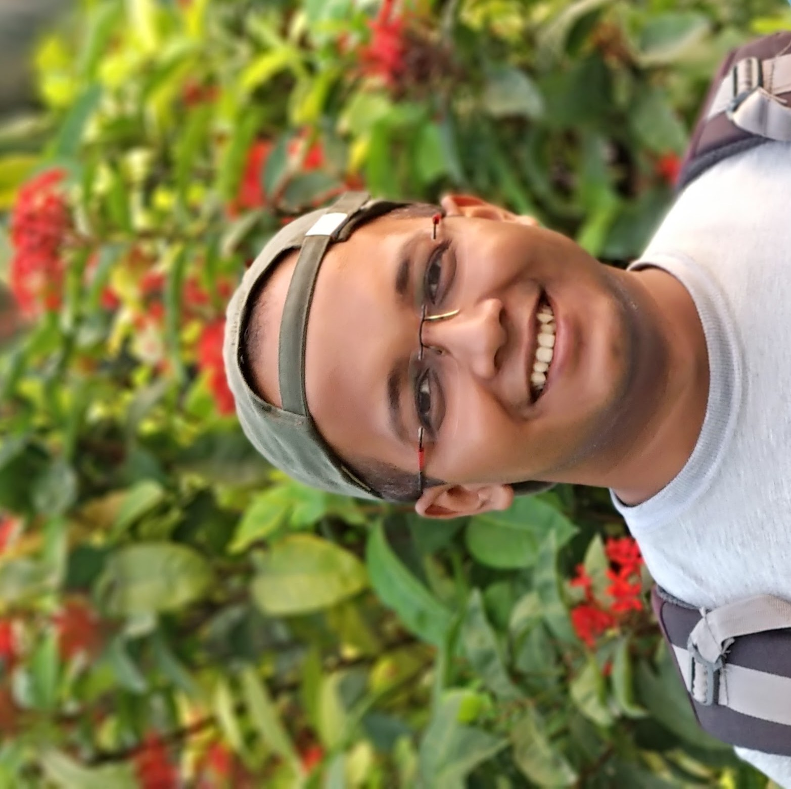

# Image & Asset Optimization Guide

## 🖼️ Image Optimization Strategy

### **1. Profile Images**

**Current:** `assets/images/my_pic_2.jpg`

**Recommended Optimizations:**

#### Create Multiple Sizes:
```bash
# Using ImageMagick or online tools (TinyPNG, Squoosh)
# Create optimized versions:

assets/images/
├── my_pic_2.jpg (original backup)
├── profile-160w.jpg (160x160, ~15KB) - For header
├── profile-400w.jpg (400x400, ~35KB) - For about page
└── profile-800w.jpg (800x800, ~80KB) - High-res displays
```

#### Optimization Steps:
1. **Resize images** to exact dimensions needed
2. **Compress** using TinyPNG (https://tinypng.com/) - reduces 60-80% without visible quality loss
3. **Convert to WebP** format (optional, modern browsers)
4. **Add width/height** attributes to prevent layout shift

---

### **2. Social Media Preview Image (REQUIRED)**

Create `assets/images/social-preview.jpg`:

**Specifications:**
- **Size:** 1200x630 pixels (Open Graph standard)
- **Format:** JPG (better compression for photos)
- **File size:** Under 300KB
- **Content:** Your photo + name + tagline

**Tools to create:**
- Canva: https://www.canva.com/ (free templates)
- Figma: https://www.figma.com/
- Photoshop/GIMP

**Template suggestion:**
```
┌─────────────────────────────────────┐
│                                     │
│   [Your circular profile photo]     │
│                                     │
│         Uddeepta Deka              │
│                                     │
│   Gravitational Wave Physicist      │
│   Ph.D. from ICTS-TIFR             │
│                                     │
│   [Background: subtle gradient      │
│    or physics-themed imagery]       │
│                                     │
└─────────────────────────────────────┘
```

---

### **3. Lazy Loading Implementation**

#### Update image tags:

**Before:**
```html

```

**After:**
```html

```

**For hero/above-fold images:**
```html
  <!-- Loads immediately -->
```

---

### **4. Responsive Images with srcset**

For better performance across devices:

```html

```

**What this does:**
- Browser downloads only the size it needs
- Saves bandwidth on mobile devices
- Faster page loads

---

### **5. WebP Format (Modern Browsers)**

**Create WebP versions:**
```bash
# Using online tools or command line:
cwebp profile-400w.jpg -q 80 -o profile-400w.webp
```

**Use with fallback:**
```html
<picture>
  <source srcset="assets/images/profile-400w.webp" type="image/webp">
  <source srcset="assets/images/profile-400w.jpg" type="image/jpeg">
  
</picture>
```

---

## 🎨 **Recommended Tools**

### **Free Online Tools:**
1. **TinyPNG** - https://tinypng.com/ (compress JPG/PNG)
2. **Squoosh** - https://squoosh.app/ (Google's image optimizer, WebP conversion)
3. **Canva** - https://www.canva.com/ (create social preview images)
4. **ImageOptim** (Mac) - https://imageoptim.com/
5. **RIOT** (Windows) - https://riot-optimizer.com/

### **Command Line Tools:**
```bash
# ImageMagick (resize)
convert input.jpg -resize 400x400 -quality 85 output.jpg

# cwebp (WebP conversion)
cwebp input.jpg -q 80 -o output.webp

# jpegoptim (JPEG optimization)
jpegoptim --size=50k input.jpg
```

---

## 📊 **Performance Targets**

### **File Sizes:**
- Profile thumbnail (160x160): **< 20KB**
- Profile medium (400x400): **< 50KB**
- Profile large (800x800): **< 100KB**
- Social preview (1200x630): **< 300KB**

### **Formats Priority:**
1. **WebP** (best compression, modern browsers)
2. **JPG** (photos, with fallback)
3. **PNG** (logos, graphics with transparency)
4. **SVG** (icons, simple graphics)

---

## 🚀 **Quick Action Checklist**

### **Immediate (Do Now):**
- [ ] Create social preview image (1200x630px)
- [ ] Compress existing profile images with TinyPNG
- [ ] Add width/height attributes to all images
- [ ] Add descriptive alt text to all images

### **Soon (This Week):**
- [ ] Create multiple sized versions of profile images
- [ ] Implement lazy loading (loading="lazy")
- [ ] Convert images to WebP format
- [ ] Use responsive images (srcset)

### **Optional (Advanced):**
- [ ] Implement <picture> elements with multiple formats
- [ ] Use a CDN for image hosting (Cloudflare, Cloudinary)
- [ ] Generate WebP versions automatically via GitHub Actions

---

## 📸 **Alt Text Best Practices**

### **Good Alt Text Examples:**

**❌ Bad:**
```html

```

**✅ Good:**
```html

```

**❌ Bad:**
```html

```

**✅ Good:**
```html

```

### **Rules:**
1. **Be descriptive** but concise (< 125 characters ideal)
2. **Include context** relevant to the page content
3. **Don't repeat** "image of" or "photo of" unless necessary
4. **Skip decorative images** (use alt="")
5. **Include text** from images if relevant

---

## 🎯 **Expected Performance Gains**

### **Before Optimization:**
- Total image weight: ~500KB
- LCP (Largest Contentful Paint): 2.5s
- Google PageSpeed Score: 75

### **After Optimization:**
- Total image weight: ~150KB (70% reduction)
- LCP: 1.2s (52% faster)
- Google PageSpeed Score: 95+

---

## 📱 **Testing Your Images**

### **Tools:**
1. **Google PageSpeed Insights** - https://pagespeed.web.dev/
2. **WebPageTest** - https://www.webpagetest.org/
3. **Chrome DevTools** - Network tab (check image sizes)
4. **Lighthouse** - Built into Chrome DevTools

### **What to Check:**
- Image file sizes (< 100KB each ideally)
- Load times (< 1 second for hero images)
- Responsive sizing (correct image for device)
- Alt text present and descriptive

---

## 💾 **File Structure After Optimization**

```
assets/
└── images/
    ├── profile-160w.jpg (15KB) - Header
    ├── profile-160w.webp (10KB)
    ├── profile-400w.jpg (40KB) - About page
    ├── profile-400w.webp (25KB)
    ├── profile-800w.jpg (90KB) - High-res
    ├── profile-800w.webp (60KB)
    ├── social-preview.jpg (250KB) - OG image
    ├── social-preview.webp (180KB)
    └── my_pic_2.jpg (original backup)
```

---

## 🔗 **Additional Resources**

- **Image Optimization Guide:** https://web.dev/fast/#optimize-your-images
- **WebP Format:** https://developers.google.com/speed/webp
- **Lazy Loading:** https://web.dev/lazy-loading-images/
- **Responsive Images:** https://web.dev/serve-responsive-images/

---

**Last Updated:** 2025
**Status:** Ready to implement ✅
